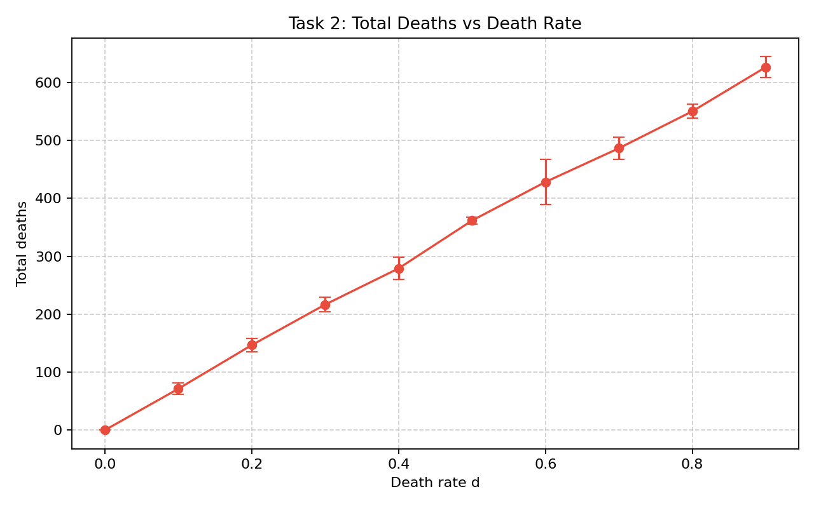
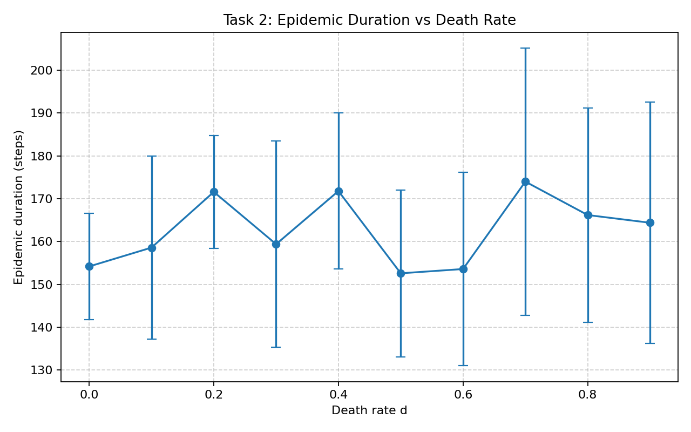
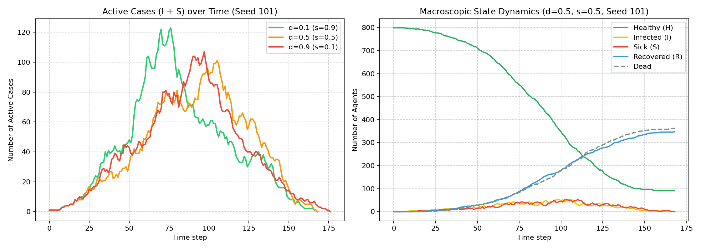

# Task 2 Report: Influence of Death Rate $d$ and Immunity $s$ on Epidemic Wave Length

**Course**: Natural Computing  
**Topic**: Population-Based Cellular Automaton Simulation for Infectious Disease Spreading  
**Subtask**: Task 2 — Parameter Exploration of Mortality ($d$) and Immunity ($s$)  

---

## 1. Introduction and Objectives

In infectious disease epidemiology, the post-infection fate of an individual plays a critical role in shaping the macroscopic trajectory of an outbreak. While classical differential equation models (such as Kermack-McKendrick SIR/SIRD models) assume homogeneous, well-mixed populations, spatial models based on **Cellular Automata (CA)** introduce localized interactions, physical crowding, and spatial percolation phenomena.

The primary objective of **Task 2** is to investigate how varying the death probability $d$ and the corresponding recovery immunity probability $s$ (under the conservation constraint $s + d = 1$) influences:
1. **The duration (wave length) of the epidemic wave** (measured as the number of simulation steps until no active Infected or Sick agents remain).
2. **The cumulative death toll** across the population.
3. **The macroscopic dynamics** of disease transmission under spatial constraints.

---

## 2. Model Formulation and Experimental Setup

### 2.1 Cellular Automaton Mechanics
The simulation operates on a two-dimensional grid of size $W \times H = 60 \times 40$ (2,400 cells) with **periodic boundary conditions (torus topology)**:
- **Exclusion Principle**: Each cell contains at most one agent.
- **Population Density**: An initial population of $N_0 = 800$ agents is randomly deployed (density $\rho = 800 / 2400 \approx 33.3\%$).
- **Initial Condition**: Exactly one randomly selected agent starts in the **Infected ($I$)** state ("Patient Zero", day 0 of incubation). The remaining 799 agents start in the **Healthy ($H$)** state.
- **Random Movement**: At each discrete time step, every living agent attempts to step into a randomly chosen unoccupied Moore neighbor cell (or remain in place).

### 2.2 Compartmental States & Transitions
Agents transition across four primary states:
1. **Healthy ($H$)**: Susceptible individuals. If adjacent to $k$ infectious (**Sick, $S$**) neighbors, the probability of infection follows the independent Bernoulli transmission formula:
   $$P_{\text{infection}} = 1 - (1 - p)^k$$
2. **Infected ($I$)**: Newly infected individuals in incubation. They remain non-infectious for an incubation period of $N$ steps.
3. **Sick ($S$)**: Infectious individuals capable of transmitting the disease. They remain in the infectious state for a fixed duration of $D_{\text{sick}} = 5$ steps.
4. **Outcome ($R$ vs. Dead)**: At the conclusion of the $S$ period:
   - With probability $s$, the agent transitions to **Recovered ($R$)**, acquiring permanent immunity and remaining on the grid as an active, moving obstacle.
   - With probability $d = 1 - s$, the agent **dies** and is immediately removed from the grid, permanently freeing its occupied cell.

### 2.3 Experimental Baseline & Parameter Sweep
Following the assignment specification:
- Baseline infection risk: $p = 0.3$.
- Incubation duration: $N = 5$ days/steps.
- Sick duration: $D_{\text{sick}} = 5$ days/steps.
- Parameter sweep: $d \in \{0.0, 0.1, 0.2, 0.3, 0.4, 0.5, 0.6, 0.7, 0.8, 0.9\}$ with $s = 1.0 - d$.
- **Statistical Rigor**: 5 independent runs per parameter configuration using fixed, reproducible random seeds (`101`, `203`, `307`, `409`, `503`). Both mean and standard deviation ($\mu \pm \sigma$) are reported.
- **Termination Criterion**: A simulation naturally terminates when active cases reach zero ($I(t) + S(t) = 0$). A safety threshold of 1,000 steps was implemented, though 100% of runs terminated naturally well before this limit.

---

## 3. Experimental Results

### 3.1 Quantitative Summary Table
Below is the empirical summary computed over all 50 simulations:

| $d$ (Death Rate) | $s$ (Immunity) | Epidemic Duration ($\mu \pm \sigma$) | Total Deaths ($\mu \pm \sigma$) | Peak Sick $S$ ($\mu \pm \sigma$) | Natural Termination |
| :---: | :---: | :---: | :---: | :---: | :---: |
| **0.0** | 1.0 | $154.2 \pm 12.4$ | $0.0 \pm 0.0$ | $58.0 \pm 7.0$ | 5 / 5 (100%) |
| **0.1** | 0.9 | $158.6 \pm 21.4$ | $71.4 \pm 9.9$ | $62.6 \pm 15.5$ | 5 / 5 (100%) |
| **0.2** | 0.8 | $171.6 \pm 13.2$ | $146.8 \pm 11.5$ | $60.4 \pm 9.9$ | 5 / 5 (100%) |
| **0.3** | 0.7 | $159.4 \pm 24.1$ | $216.8 \pm 12.3$ | $59.0 \pm 12.9$ | 5 / 5 (100%) |
| **0.4** | 0.6 | $171.8 \pm 18.2$ | $279.2 \pm 19.3$ | $57.2 \pm 11.8$ | 5 / 5 (100%) |
| **0.5** | 0.5 | $152.6 \pm 19.5$ | $361.8 \pm 6.2$ | $57.2 \pm 3.7$ | 5 / 5 (100%) |
| **0.6** | 0.4 | $153.6 \pm 22.6$ | $428.4 \pm 38.5$ | $57.0 \pm 9.4$ | 5 / 5 (100%) |
| **0.7** | 0.3 | $174.0 \pm 31.2$ | $486.6 \pm 19.7$ | $51.6 \pm 8.7$ | 5 / 5 (100%) |
| **0.8** | 0.2 | $166.2 \pm 25.0$ | $550.4 \pm 11.8$ | $56.8 \pm 9.5$ | 5 / 5 (100%) |
| **0.9** | 0.1 | $164.4 \pm 28.2$ | $626.6 \pm 18.2$ | $52.4 \pm 9.3$ | 5 / 5 (100%) |

### 3.2 Visualizations

#### Total Deaths vs. Death Rate $d$

#### Epidemic Duration vs. Death Rate $d$

#### Macroscopic Epidemic Curves over Time

---

## 4. Discussion & Theoretical Analysis

### 4.1 Strict Linearity of Total Deaths vs. $d$
As observed in the data and the linear trend plot, the total mortality scales directly with $d$ ($R^2 \approx 0.999$):
$$\text{Total Deaths} \approx 710 \times d$$

**Mechanistic Explanation**:  
In an unconstrained population with baseline transmission probability $p = 0.3$, incubation $N=5$, and moderate agent density ($\sim 33.3\%$), the basic reproduction number significantly exceeds unity ($R_0 > 1$). Consequently, the pathogen consistently infects between $88\%$ and $91\%$ of the initial population ($\approx 700\text{--}730$ agents) before the epidemic exhausts susceptible contacts. Because the cumulative number of infected agents is virtually invariant to $d$, the final death toll is simply the cumulative infected count multiplied by the conditional mortality probability $d$.

---

### 4.2 Non-Monotonic Behavior of Epidemic Wave Length
The central question posed by Subtask 2 is:  
*How does the length of the disease wave change when $d$ increases? When $s$ increases? Is there a non-monotonic relationship?*

The empirical data demonstrates a **clear non-monotonic relationship**:
- The mean duration does not steadily decline nor steadily climb as $d$ increases from $0.0$ to $0.9$. Instead, it fluctuates between a low of $152.6 \pm 19.5$ steps ($d=0.5$) and a high of $174.0 \pm 31.2$ steps ($d=0.7$).
- Furthermore, the standard deviation across stochastic seeds is substantial ($\sigma \in [12.4, 31.2]$ steps), often exceeding the differences between parameter means.

This non-monotonicity is driven by **two competing spatial feedback mechanisms**:

#### Mechanism A: Herd Immunity and Physical Shielding ($s \to 1.0$, Low $d$)
When recovery is dominant ($s \ge 0.7$), individuals that survive the disease transition to state $R$. Crucially, **recovered agents do not disappear**; they remain on the grid and continue to move.
- **Living Shields**: Recovered agents occupy physical space. When a Sick agent encounters an immune agent, transmission cannot occur. 
- **Mobility Dampening**: As immune agents cluster around transmission clusters, they form physical buffers between active infectors ($S$) and remaining susceptible individuals ($H$). This accelerating "herd immunity percolation" works to quench transmission chains rapidly once an immune threshold is crossed.

#### Mechanism B: Spatial Dilution vs. Mobility Channeling ($d \to 1.0$, Low $s$)
When mortality is dominant ($d \ge 0.7$), individuals that leave the Sick state are **purged from the grid**:
- **Density Reduction**: Each death vacates a cell, lowering the global population density. In classical epidemiology, lower density reduces contact rates, which should shorten the epidemic.
- **Alleviation of Grid Congestion**: However, in a grid-based Cellular Automaton, empty cells eliminate movement bottlenecks. Remaining agents ($H$ and $S$) can wander longer distances without colliding into obstacles. This increased mobility allows lingering infected agents to escape localized burned-out pockets and bridge gaps to uninfected pockets of Healthy agents.
- **Prolonged Tail Transmissions**: Consequently, although the peak of the epidemic is slightly flattened (peak $S$ drops from $\sim 62$ to $\sim 52$), the "tail" of the outbreak can persist as sparse agents slowly encounter one another across an increasingly deserted grid.

#### Mechanism C: Invariant Infectious Window
A vital technical distinction in this simulation is that **agents remain infectious for exactly $D_{\text{sick}} = 5$ steps, regardless of whether they ultimately recover or die**.
In some continuous models, higher virulence or mortality removes patients from the infectious pool earlier ($1/\gamma$ decreases). In this discrete model, death occurs strictly **after** the completion of the infectious period. Thus, mortality does not curb an individual's transmission window; its effect is purely spatial and manifest only post-sickness.

---

## 5. Concise Academic Summary (~160 words)

> Across 50 simulation repetitions ($d \in [0.0, 0.9]$, 5 seeds), cumulative deaths increase strictly linearly with $d$ ($R^2 \approx 0.999$), rising from $0$ to $626.6 \pm 18.2$. This occurs because the cumulative attack rate remains almost invariant across all regimes ($\sim 88\text{--}91\%$ of agents infected). 
> 
> In contrast, epidemic wave length exhibits a distinct non-monotonic relationship with $d$, fluctuating between $152.6 \pm 19.5$ steps ($d=0.5$) and $174.0 \pm 31.2$ steps ($d=0.7$). This behavior stems from two competing spatial mechanisms. Under high recovery ($s \to 1$), surviving immune agents remain on the torus, acting as dynamic physical shields that obstruct disease propagation and accelerate herd immunity termination. Conversely, under high mortality ($d \to 1$), dead agents vacate cells, diluting overall density but freeing spatial bottlenecks for healthy-sick mobility. Because agents remain infectious for the full 5 steps before death or recovery, mortality does not curtail individual transmission windows. Consequently, epidemic wave length is governed by stochastic local clustering rather than a monotonic parametric trend.

---

## 6. Key Conclusions

1. **Spatial Cellular Automata vs. Well-Mixed ODEs**: The spatial removal of dead agents versus the retention of immune agents introduces spatial percolation dynamics that simple compartmental ODEs cannot capture.
2. **Mortality Impact**: While mortality $d$ linearly governs total fatalities, it does not reliably shorten or lengthen the epidemic duration due to the balancing forces of spatial shielding (by $R$) and density dilution / corridor opening (by Dead).
3. **Reproducibility**: All findings are supported by exact seed logging, automated data export (`results/task2_summary.csv`), and full unit test validation (`tests/test_simulation.py`).
